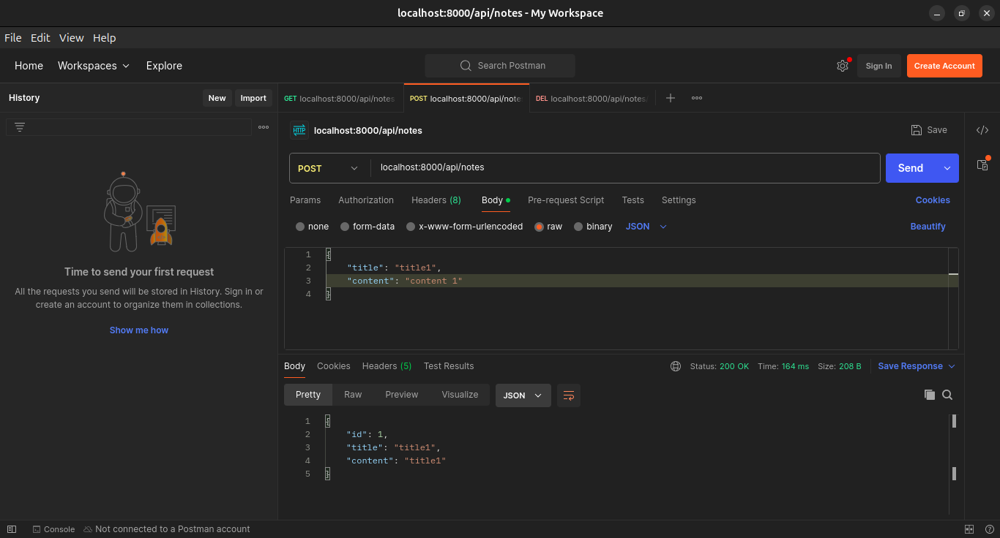
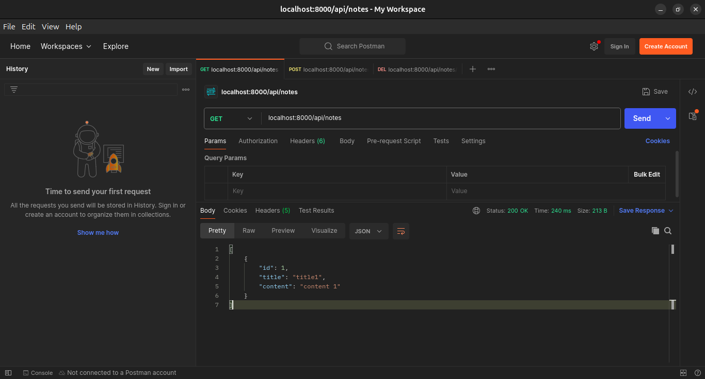
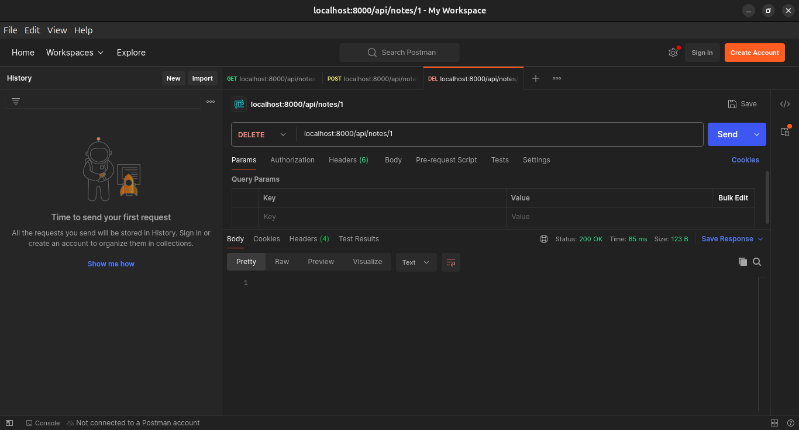

# Aplikasi Simple Note Backend #

Prasyarat :
- Java SDK 11
- Maven

## Cara Menjalankan Aplikasi ##

1. Jalankan aplikasi dengan perintah berikut di Terminal/Git-Bash

    ```
    mvn clean spring-boot:run
    ```
2.  Cek Endpoint

    ```
    curl http://localhost:8000/api/notes
    ```

[](img/createNote.png)
[](img/getAllNote.png)
[](img/deleteNote.png)